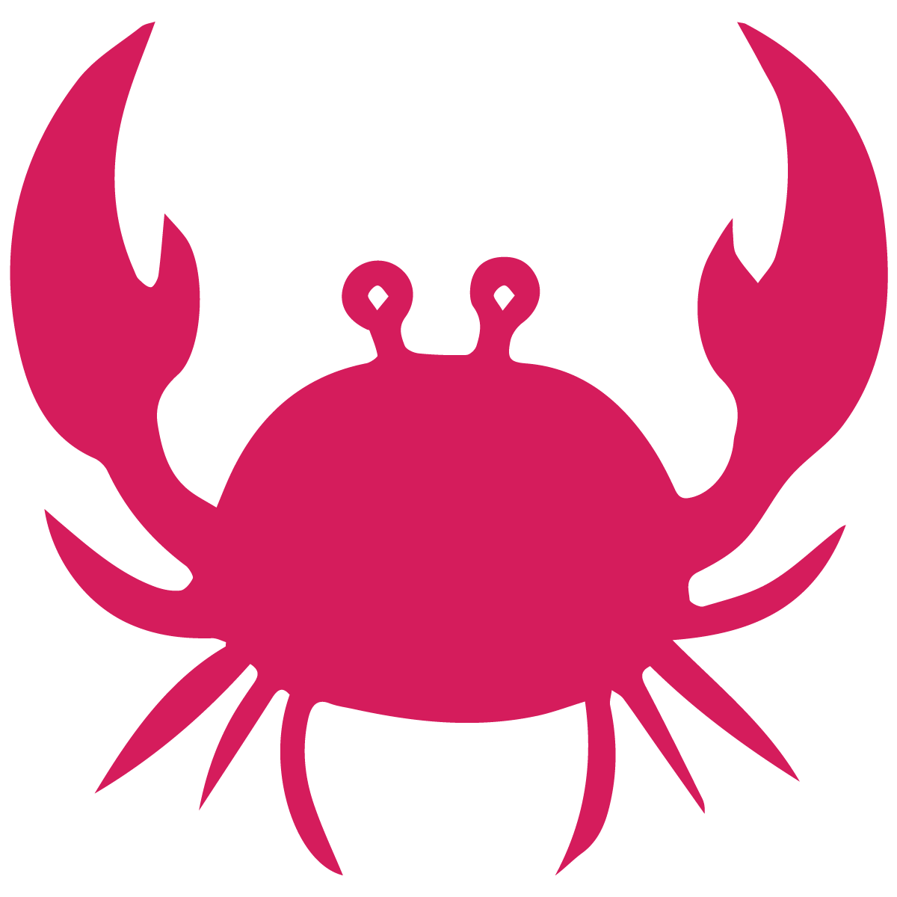
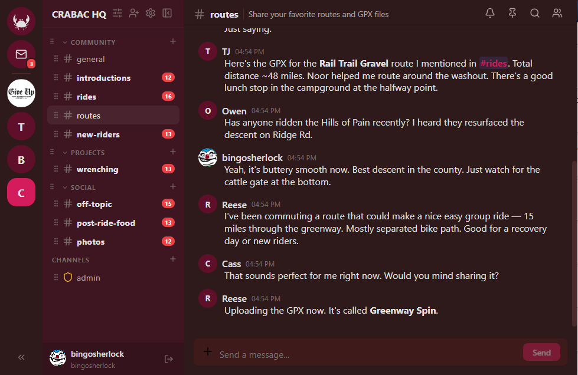
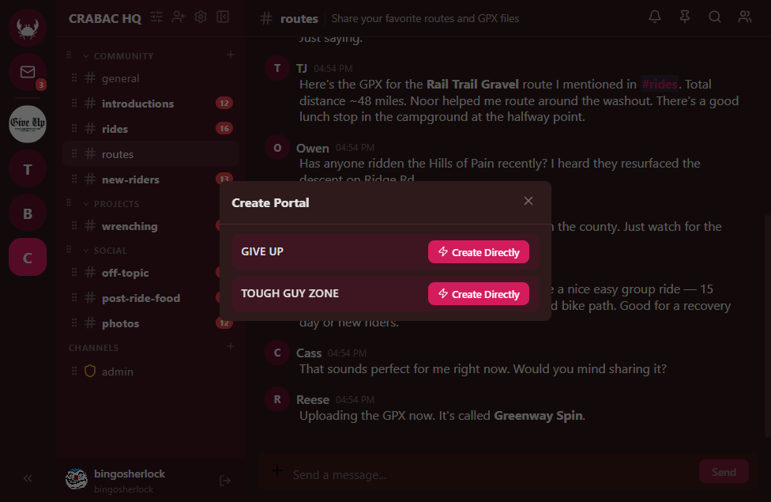
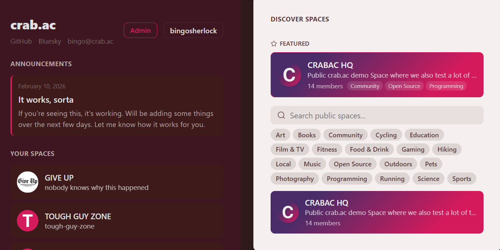
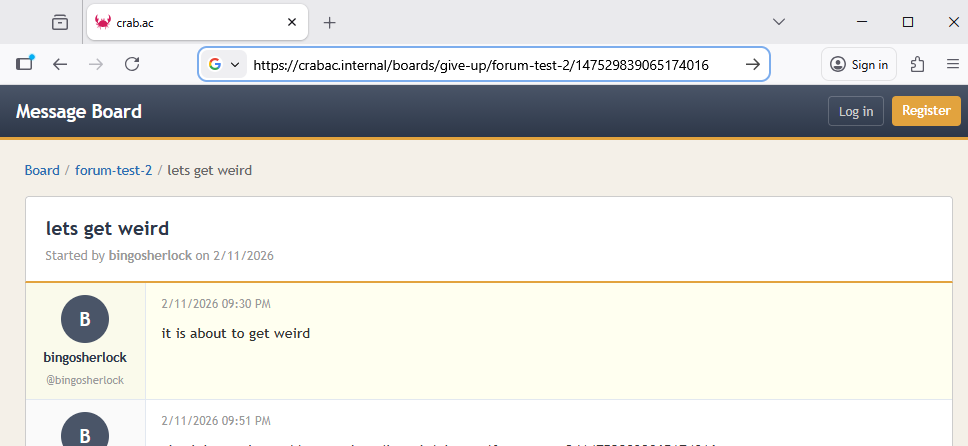
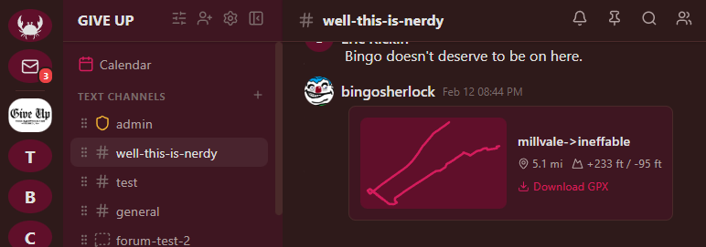
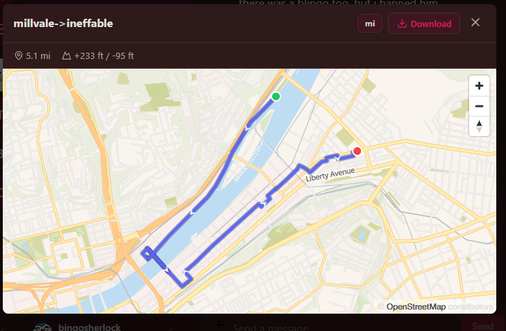
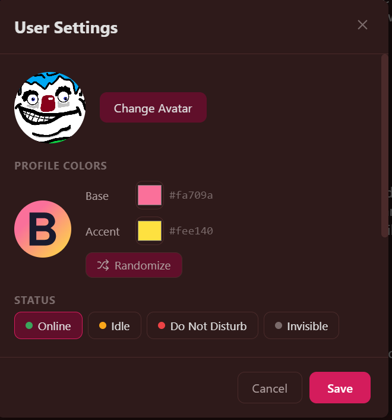
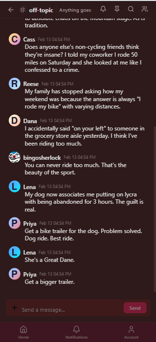
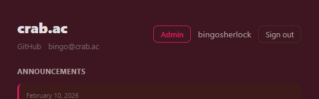

<p align="center">
  
</p>

# crab.ac

[GitHub](https://github.com/cmactaggart/crabac) | [Bluesky](https://bsky.app/profile/crabac.bsky.social) | [bingo@crab.ac](mailto:bingo@crab.ac)

An open-source community chat, public comms, and organization platform.

Basically, over the last few years I've been cobbling together small proofs of concept around tools I thought would be helpful for organizing a bike community. Recently I started integrating them all into and around a chat client. The result is a platform that is tailored to organizing a real world community in a cohesive manner. In merging all of these concepts into a unified platform, I realized some things that would make it work better and generally be more usable and intuitive, and I figured the best path forward was to just open source the whole thing and start working on it and iterating it in public.



## Most Recent Updates

- **Public calendar** — public web view for community calendars with per-event visibility control
- **Media gallery channels** — upload/grid view with detail overlay and public gallery viewer
- Per-user branding colors with gradient SVG default avatars
- Public space directory with featured spaces and tag-based filtering
- Space branding colors (custom gradients on space cards)
- Slash commands (`/shrug`, `/tableflip`, `/lenny`, `/me`, etc.)
- Plugin system with RAGflow chatbot integration
- Cross-platform desktop app (Windows, macOS, Linux) with auto-updater
- Community calendar with color-coded event categories and chat embeds
- Mobile-responsive layout with fixed message input
- Forum channels with threaded discussions and public boards

## Why crab.ac?

crab.ac was originally built by people who run a bike club. The result is a platform that works well for the usual chat stuff but also has some ideas about how independent communities interact with each other and with the public — public forums, shared calendars, media galleries, and cross-community channel linking are all first-class features.

---

## Distinctive Features

### Portals

Portals allow two completely independent spaces to share a single channel between them. Messages sent in one space appear in the other, and vice versa.

This solves a real problem: two groups that want their own independent spaces — their own roles, their own channels, their own members — but need a place to coordinate. For example:

- A **cycling club** and a **running club** in the same city might portal a `#weekend-rides-and-runs` channel so members of either group can plan joint events without needing to join both spaces.
- A **game development studio** and their **community playtest group** might portal a `#feedback` channel so testers can talk directly to devs without getting access to internal channels.
- A **neighborhood association** and the **local parks department** might portal a `#park-projects` channel for public collaboration while keeping their internal discussions private.

Portals can be created directly (if you have permission in both spaces) or proposed via a portal invite that the target space's admins can accept or reject.



### Public Spaces & Featured Directory

Spaces can be made public, allowing anyone to discover and join them from the home screen's "Discover Spaces" directory. Public spaces support:

- **Tag-based filtering** — spaces can add up to 10 tags for discoverability
- **Featured spaces** — highlighted at the top of the directory by platform admins
- **Custom branding** — base color, accent color, and text color that render as gradient cards
- **Guest access** — optional email verification requirement for public joiners



### Public Web Components

Not everything belongs behind a login. crab.ac lets spaces selectively expose content to the public internet through dedicated, clean web views — each toggleable independently from Space Settings > Public Web.

#### Public Boards (Forums)

Forum channels can be marked as public to create an external-facing discussion board. Visitors can browse threads and posts without an account (if anonymous browsing is enabled), and register for a lightweight board-only account to participate without needing a full platform membership.

URL: `app.crab.ac/boards/your-space-slug`



#### Public Galleries

Media gallery channels can be made public, giving the community a browsable image/media gallery on the web. The gallery view shows a responsive grid of uploads with a detail overlay for individual items.

URL: `app.crab.ac/gallery/your-space-slug`

#### Public Calendar

The community calendar can be exposed as a read-only public web page. Individual events are marked as public or private when created — public events appear on the web view, while private events stay visible only to space members. Logged-in space members who visit the public URL see all events.

URL: `app.crab.ac/calendar/your-space-slug`

#### How It Works

Each public web component is controlled by its own toggle in admin settings:

- **Enable Public Boards** — exposes forum channels marked as public
- **Enable Public Galleries** — exposes media gallery channels marked as public
- **Enable Public Calendar** — exposes events marked as public
- **Allow Anonymous Browsing** — shared toggle that controls whether visitors need to log in to view any of the above

All public web views share a consistent light-theme layout with the space name, a login link back to the full app, and a "Powered by crab.ac" footer.

### GPX Track Rendering

Upload a `.gpx` file to any channel and it renders inline as a rich card with an interactive map, distance, elevation gain, and duration. Click to expand into a full map modal with the track plotted on OpenStreetMap tiles via MapLibre.

This exists because the people who built this needed it. If your community involves cycling, running, hiking, or any GPS-tracked activity, route sharing is a first-class feature rather than a file download.




### User Branding & Gradient Avatars

Every user gets a personal color palette (base + accent) that renders as a gradient background on their default avatar. Colors are randomly assigned at registration and can be customized in User Settings with a live preview and randomize button.



---

## Feature Overview

### Communication
- **Real-time messaging** with Socket.io — typing indicators, presence (online/idle/offline), message editing and deletion
- **@mentions** with autocomplete — `@user`, `@everyone`, `@here`
- **Direct messages** and **group DMs** with message request flow for non-friends
- **Forum channels** with threaded discussions, pinning, and locking
- **Announcement channels** for one-way broadcast
- **Slash commands** — `/shrug`, `/tableflip`, `/unflip`, `/me`, `/lenny` with autocomplete palette
- **Message search** with `from:user` and `in:channel` operators
- **Reactions** with emoji picker

### Organization
- **Spaces** with channels, categories, and drag-and-drop reordering
- **Role-based access control** with granular bitfield permissions (20+ permission flags)
- **Channel categories** with collapsible groups
- **Invite system** with configurable expiry and usage limits
- **Space branding** — custom gradient colors and text color for space cards

### Social
- **Friend system** with requests, mutual friends display, and profile popovers
- **User muting** (hide messages) and **channel muting**
- **Per-space notification preferences** — suppress mentions, suppress @everyone/@here, or mute entirely
- **Unified notification center** with bell icon badge, browser tab indicators (favicon + title count)
- **User branding colors** — personalized gradient avatars with SVG letter icons

### Community Tools
- **Community calendar** with month grid, event categories (color-coded), rich embed cards in chat, and public web view
- **Public space directory** with featured spaces, tags, and custom branding
- **Public web components** — forums, media galleries, and calendars each get a dedicated public web view with optional anonymous browsing
- **Media gallery channels** with upload grid, detail overlay, and public gallery viewer
- **Portals** for cross-space channel linking
- **System announcements** with persistent dismissal tracking
- **Plugin system** with chatbot integration (RAGflow-powered bots with BOT badge)

### Media & Files
- **File uploads** with image previews and lightbox
- **GPX track rendering** with interactive MapLibre maps
- **Space and user avatars** with gradient fallbacks
- **Markdown rendering** (GFM) with code blocks, tables, and link previews

### Security
- **Email verification** and **magic link login**
- **TOTP two-factor authentication** with QR code setup
- **JWT access + refresh token** auth with automatic refresh
- **Rate limiting** on auth and public endpoints
- **Web Application Firewall** (Coraza/OWASP CRS) in the default deployment config

---

## Client Status

| Platform | Status |
|----------|--------|
| **Web (desktop)** | Stable — full-featured client |
| **Web (mobile)** | Responsive layout with bottom tab bar, fixed message input, mobile-optimized pages |
| **Desktop (Electron)** | Cross-platform builds (Windows, macOS, Linux) with auto-updater, tray icon, minimize-to-tray |
| **Native mobile** | In testing |




---

## Tech Stack

- **Frontend**: React 19, Vite, Zustand, Socket.io Client, MapLibre GL
- **Backend**: Express, TypeScript, Knex, MySQL, Redis, Socket.io
- **Shared**: Zod validation schemas, TypeScript types, permission bitfields
- **Desktop**: Electron with electron-builder, auto-updater
- **Infrastructure**: Caddy with Coraza WAF (OWASP CRS), Cloudflare Tunnels

---

## Installation

### Prerequisites

- Node.js 20+
- pnpm 9+
- MySQL 8+
- Redis 7+

### Quick Start

```bash
git clone https://github.com/cmactaggart/crabac.git
cd crabac

# Install dependencies
pnpm install

# Set up the database
mysql -u root -e "CREATE DATABASE crabac; CREATE USER 'crabac'@'localhost' IDENTIFIED BY 'crabacpass'; GRANT ALL ON crabac.* TO 'crabac'@'localhost';"

# Copy and edit environment config
cp .env.example packages/api/.env
# Edit packages/api/.env with your SMTP credentials, JWT secret, etc.

# Run database migrations
pnpm db:migrate

# (Optional) Seed with sample data
pnpm db:seed

# Build the shared package
pnpm --filter @crabac/shared run build

# Start development servers
pnpm dev
```

The web client will be available at `http://localhost:5173` and the API at `http://localhost:3001`.

### SMTP Configuration

crab.ac sends email for account verification, magic link login, and password resets. You'll need a working SMTP server. Configure these values in `packages/api/.env`:

```env
SMTP_HOST=email-smtp.us-east-1.amazonaws.com
SMTP_PORT=587
SMTP_USER=your-smtp-username
SMTP_PASS=your-smtp-password
SMTP_FROM=Your App <noreply@yourdomain.com>
```

**Heads up:** Most residential ISPs and many cloud providers (AWS, GCP, Azure) block outbound traffic on port 25 by default. Even port 587 may require you to request unblocking on some platforms. Rather than fighting your ISP, you're almost certainly better off using a commercial SMTP provider:

- **Amazon SES** — cheap, reliable, requires domain verification and a request to move out of sandbox mode
- **Resend** — developer-friendly, generous free tier
- **Postmark** — great deliverability, straightforward setup
- **Mailgun**, **SendGrid** — established options with free tiers

Any provider that gives you SMTP credentials (host, port, username, password) will work. Plug them into the `.env` and you're done.

**SMTP is not optional.** New users must verify their email before they can log in, so if email delivery isn't working, nobody gets past the registration screen. Make sure your SMTP credentials are configured and working before inviting anyone.

### Admin Access

There's no special setup wizard or first-run flow. Admin access is controlled by a comma-separated list of email addresses in your `.env`:

```env
ADMIN_EMAILS=you@yourdomain.com,another-admin@yourdomain.com
```

Any registered user whose email matches this list gets an **Admin** button on the home screen that opens the admin panel. From there you can manage users, spaces, and system announcements.




If you've just added your email to `ADMIN_EMAILS` and don't see the button, restart the API server and refresh the page — the admin flag is checked at login time, so you'll need a fresh session for it to take effect.

### Production Deployment with Caddy + Cloudflare Tunnels

If you're going to run this live on the dirty public internet, we recommend a setup that avoids exposing any public ports on the host machine.  **Note: we don't actually recommend running this live on the dirty public internet** unless you **absolutely** know what you're doing and know all of the dangers associated with putting live servers on the internet, but if you're going to do it and want a quick and dirty way to make it a little more secure, try this:

1. **Caddy with Coraza WAF** runs on a local-only port (e.g., `:3030`) and reverse-proxies to the API and frontend. The included `infra/Caddyfile` configures OWASP Core Rule Set for request filtering, routes Socket.io traffic around the WAF (since WebSocket upgrades trip false positives), and serves static files for desktop app updates.

2. **Cloudflare Tunnel** (`cloudflared`) connects your domain to the local Caddy port without opening any inbound ports. Traffic flows: `internet → Cloudflare edge → tunnel → Caddy :3030 → Express/Vite`.

```
Internet → Cloudflare Edge → cloudflared tunnel → Caddy (:3030, WAF) → Express API (:3001)
                                                                      → Vite Dev (:5173)
```

This gives you:
- **No exposed ports** — the server has no public-facing listeners
- **DDoS protection** from Cloudflare's edge network
- **WAF** via Coraza with OWASP CRS anomaly scoring
- **TLS termination** at Cloudflare (no cert management on the server)

To set this up:

```bash
# Install cloudflared
# See: https://developers.cloudflare.com/cloudflare-one/connections/connect-networks/

# Create a tunnel pointing to your Caddy port
cloudflared tunnel create crabac
cloudflared tunnel route dns crabac app.yourdomain.com

# Build Caddy with Coraza WAF plugin
# The infra/ directory includes the Caddyfile and coraza.conf
xcaddy build --with github.com/corazawaf/coraza-caddy/v2

# Run Caddy
./caddy run --config infra/Caddyfile

# Run cloudflared as a service
sudo cloudflared service install
```

---

## License

[MIT](LICENSE) - Copyright (c) 2025-2026 The crab.ac Contributors
