<p align="center">
  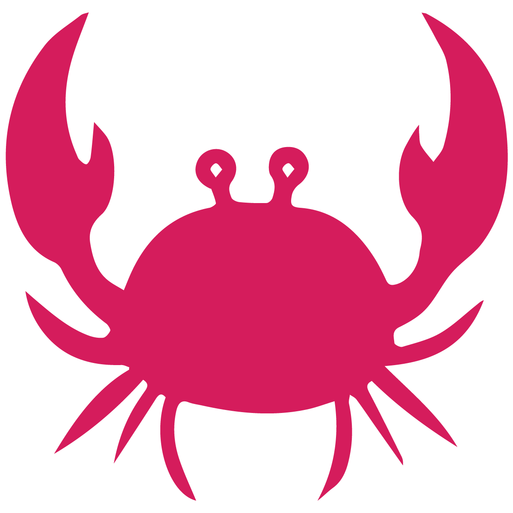
</p>

# crab.ac

An open-source community organization platform — communication, coordination, social, and public presence in one place.

crab.ac is a unified platform for running real-world communities: clubs, neighborhoods, coalitions, creative groups, outdoor activity organizations, and more. It brings together real-time chat, forums, calendars, route libraries, media galleries, social profiles, a news feed, blogs, workflow automation, and cross-community linking into a single integrated system.

The platform is especially well-suited for outdoor activity communities (cycling, running, hiking, etc.) but the tools are general-purpose enough for any group that needs to communicate, coordinate, and share with each other and the public.

[GitHub](https://github.com/cmactaggart/crabac) | [Bluesky](https://bsky.app/profile/crabac.bsky.social) | [bingo@crab.ac](mailto:bingo@crab.ac)

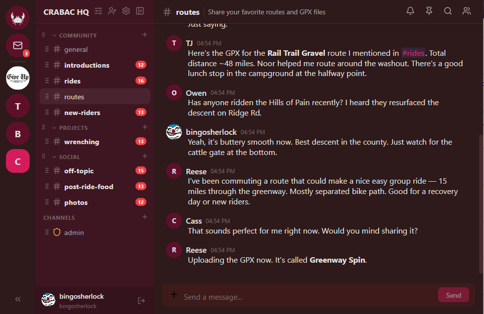

---

## What's New in 0.4.0

- **Social profiles** — personal galleries, route collections, event calendars, and a post feed on every user profile with visibility controls (public/friends/private)
- **User posts** — text posts with photo/route attachments, friend tagging, reactions, comments, and reposts
- **Follows** — one-way follows for public profiles; friends count as implicit bidirectional follows
- **Social feed** — aggregated feed of posts from followed users, friends, and self with infinite scroll
- **Personal collections** — users can curate their own photos, routes, and events independently of any space, and copy items into space channels
- **Profile visibility** — configurable profile privacy (public, friends-only, private) with per-item visibility overrides

---

## Why crab.ac?

Community platforms tend to do one thing well and bolt on everything else. crab.ac treats communication, organization, social, and public presence as equal first-class concerns:

- **Communication** — real-time chat, forums, DMs, slash commands
- **Organization** — calendars, route libraries, role-based permissions, workflow automation
- **Social** — user profiles with posts, follows, personal collections, and a news feed
- **Public presence** — forums, galleries, blogs, calendars, and route libraries each independently publishable to the web
- **Cross-community** — portals that link channels across independent spaces

The result is a single platform where a community can share routes, plan events, post photos, publish a blog, run automated workflows, and maintain social profiles — all without stitching together separate services.

---

## Core Concepts

### Spaces

A Space is a community — it has channels, members, roles, and settings. Think of it as a self-contained organization. Spaces can be private (invite-only) or public (discoverable in the directory). Each space has its own admin settings, role hierarchy, calendar, blog, and public web presence.

### Channels

Channels live inside spaces and come in several types:

| Type | Purpose |
|------|---------|
| **Text** | Real-time chat with @mentions, reactions, file uploads, GPX rendering |
| **Announcement** | One-way broadcast from users with Send Messages permission |
| **Forum** | Threaded discussions with pinning and locking |
| **Media Gallery** | Photo/video uploads in a grid layout with detail overlay |
| **Route Library** | GPX route management with maps, stats, categories, and search |

### Roles & Permissions

Access control uses a bitfield RBAC system with 23 granular permission flags. Roles are stacked — a member with multiple roles gets the union of all their permissions. The space owner bypasses all checks.

---

## Communication

### Real-Time Chat

Messages are delivered in real-time via Socket.io with typing indicators, online/idle/offline presence, and emoji reactions. Messages support Markdown (GFM), inline code blocks, file attachments with image previews, and @mention autocomplete (`@user`, `@everyone`, `@here`).


### Direct Messages & Group DMs

1:1 and group direct messages with a message request flow for non-friends. Group DMs support up to 10 participants with custom names.

<!-- TODO: screenshot of DM conversation -->
<!--  -->

### Forums

Forum channels support threaded discussions with pinning, locking, and moderation controls. Forum threads can be exposed as public boards with optional anonymous browsing and lightweight board-only registration.

<!-- TODO: screenshot of forum channel with threads -->
<!--  -->

### Slash Commands

Built-in commands (`/shrug`, `/tableflip`, `/unflip`, `/me`, `/lenny`) plus custom commands defined through the workflow system. All commands show an autocomplete palette as you type.

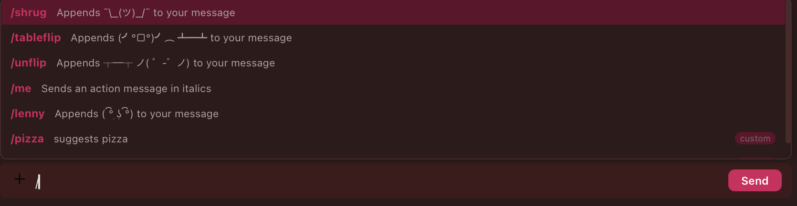

### Search

Full-text message search with `from:user` and `in:channel` operators.

---

## Social Profiles & Feed

Every user has a personal profile page with social features that work independently of any space.

### User Profiles

Each profile includes personal collections (photos, routes, events), social posts, follower/following counts, and customizable branding colors. Profile visibility is configurable: public, friends-only, or private.

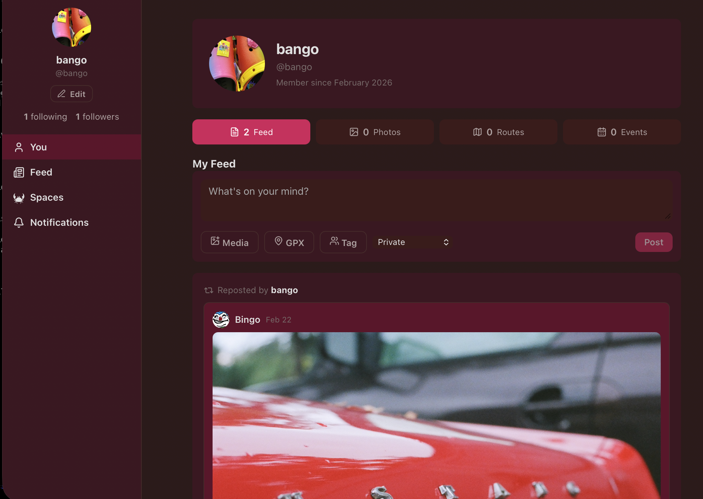

### Posts

Users can publish posts with text, photo attachments, route attachments, and friend tags. Posts support reactions, comments, and reposts. Each post has its own visibility setting (public, friends, private).

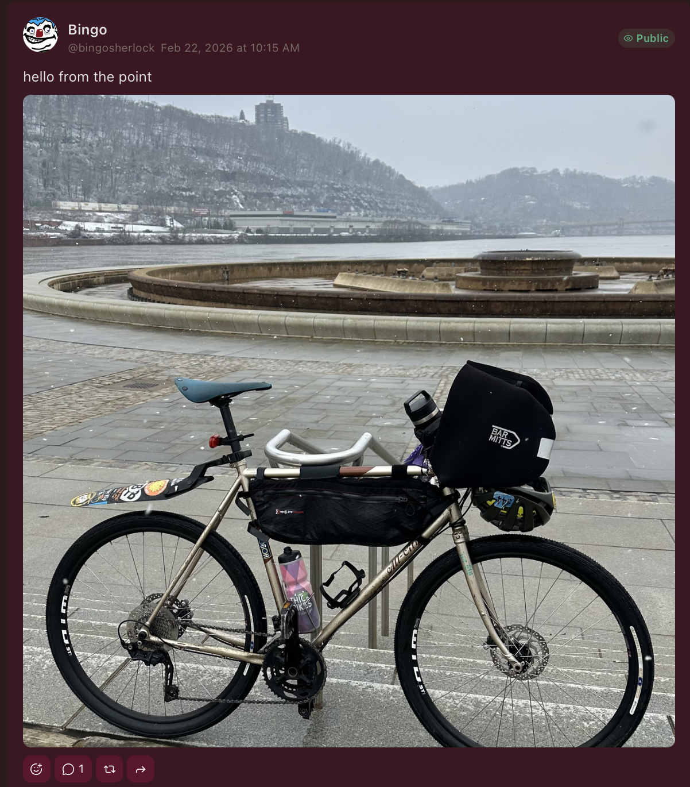

### Follows & Feed

One-way follows let users subscribe to public profiles. Friends (mutual, bidirectional) count as implicit follows in both directions. The feed aggregates posts from followed users, friends, and self in reverse chronological order with infinite scroll.

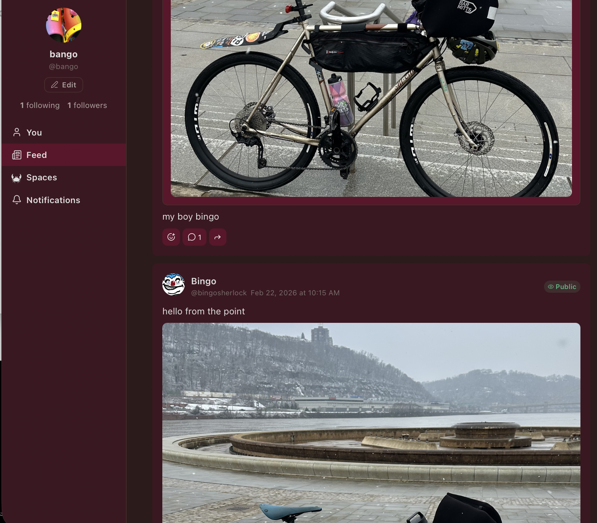

### Personal Collections

Users can curate their own photos, routes, and events on their profile — independent of any space. Collection items can be copied into space channels (galleries, route libraries, calendars) when needed, bridging personal and community content.

---

## Community Organization

### Community Calendar

A full month-grid calendar with color-coded event categories, per-event RSVP tracking (going/maybe/not going), location fields, activity type tagging, and direct route linking from the route library.

**Recurring events** support weekly and monthly recurrence patterns with per-occurrence overrides and cancellations. When an occurrence is cancelled, RSVP'd members get notified automatically.

<!-- TODO: screenshot of calendar month view -->
<!--  -->

### Route Library

Route library channels are purpose-built for organizing and curating GPS routes. Upload GPX files directly or save them from chat message attachments. Routes are parsed on upload to extract distance, elevation gain/loss, flatness score, and a GeoJSON track for map rendering.

Routes can be:
- Categorized and tagged by activity type (ride/run/walk)
- Starred/favorited by individual members
- Searched and sorted by name, distance, elevation, or flatness
- Viewed in card or table layout
- Linked directly to calendar events (pre-fills location and activity type)
- Made public for a web-facing route catalog

<!-- TODO: screenshot of route library card view -->
<!--  -->

### GPX Track Rendering

Upload a `.gpx` file to any text channel and it renders inline as a rich card with an interactive map, distance, elevation gain, and duration. Click to expand into a full map modal with the track plotted on OpenStreetMap tiles via MapLibre GL.

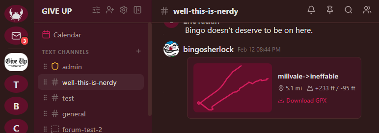
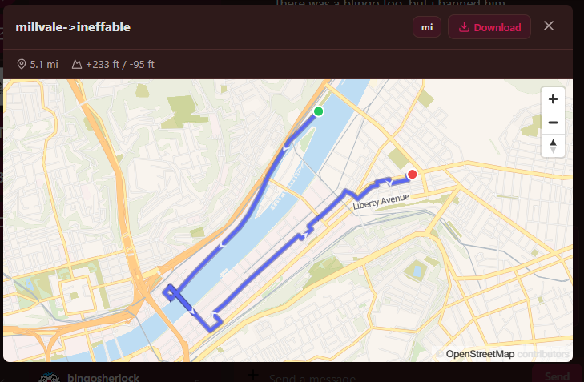

### Media Galleries

Media gallery channels display uploads in a responsive photo grid with a detail overlay for viewing, navigation, and metadata. Galleries support multi-file uploads with captions.

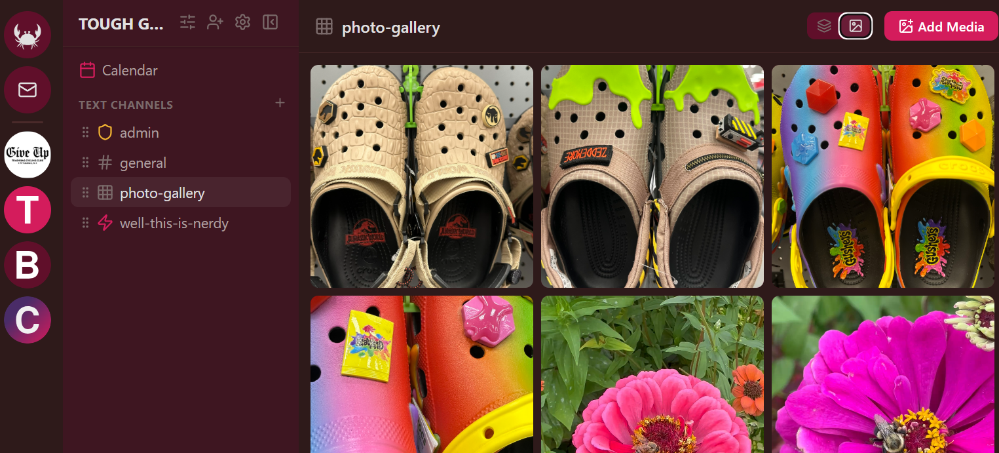

### Community Blog

A built-in blogging system with a Markdown editor, inline image uploads, live preview, and a draft/publish workflow. Posts can individually be made public for the external blog web view.

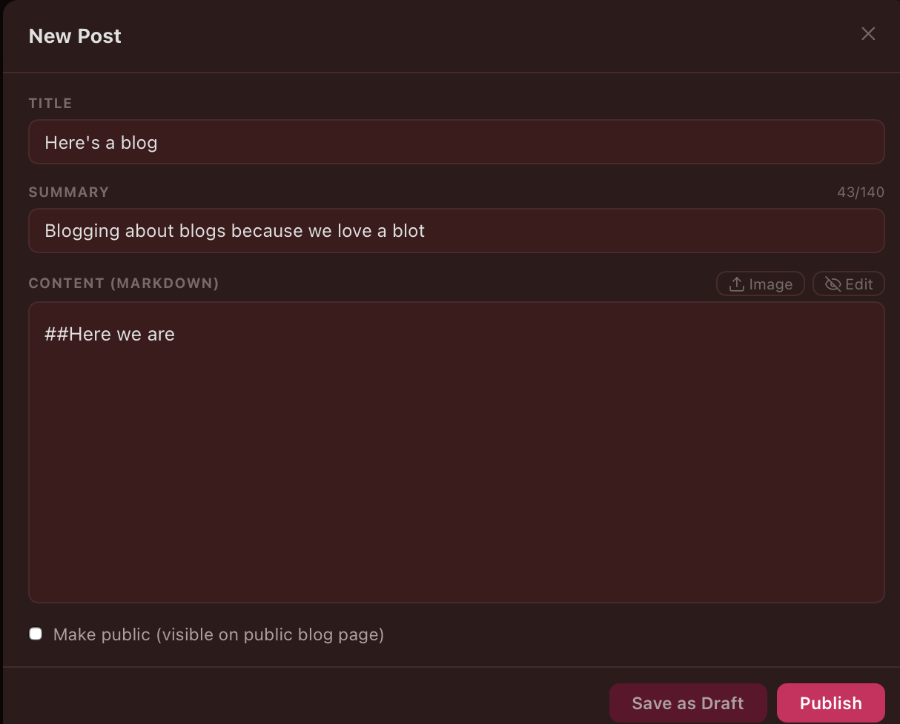

---

## Automation & Workflows

The workflow engine lets space admins automate repetitive tasks using a **trigger-condition-action** framework. No code required — workflows are configured through a visual editor in Space Settings.

### How It Works

Every workflow has three parts:

1. **Trigger** — the event that starts the workflow
2. **Conditions** (optional) — rules that must be true for the workflow to proceed
3. **Actions** — what happens when the trigger fires and conditions pass

Conditions support nested AND/OR logic with negation, so you can build complex rules like "message contains 'ride' AND user has role 'Member' AND channel is #general".

### Trigger Types

| Trigger | Fires When | Example Use |
|---------|-----------|-------------|
| **Member Joined** | A new member joins the space | Welcome message, auto-assign roles |
| **Message Created** | A message is sent in any channel | Auto-moderation, keyword routing |
| **Image Uploaded** | A message contains image attachments | Auto-copy photos to a gallery channel |
| **GPX Uploaded** | A message contains .gpx file attachments | Auto-import routes to the route library |
| **Slash Command** | A custom command is invoked | User-triggered actions with arguments |
| **Card Interaction** | A member clicks a button or submits a card form | Approval flows, polls, signups |
| **Webhook** | An external service hits the space's webhook URL | Strava activity posting, payment confirmations |

### Action Types

| Action | What It Does |
|--------|-------------|
| **Send Message** | Post a message to a specific channel (supports `{{variable}}` interpolation) |
| **Send Admin Message** | Post a message to the space's admin channel |
| **Add Role** / **Remove Role** | Manage member roles automatically |
| **Copy Images to Gallery** | Copy image attachments from a message to a gallery channel |
| **Copy Routes to Library** | Import GPX files from a message into a route library channel |
| **Show Card** | Display an interactive card with buttons and form fields |
| **Update Card** / **Dismiss Card** | Modify or remove an active card |
| **Send Webhook** | POST data to an external URL |

### Real-World Examples

#### Welcome Flow with Role Assignment

> **Trigger:** Member Joined
> **Condition:** Invite code is "BIKECLUB2026"
> **Actions:**
> 1. Send message to #welcome: "Welcome {{displayName}}! Check out #routes for local rides and #calendar for upcoming group rides."
> 2. Add role: "Verified Member"

New members who join via a specific invite link get a personalized welcome message and automatic role assignment. Members who join via a different invite or the public directory get a different flow (or no flow at all).

#### Auto-Route Library from Chat

> **Trigger:** GPX Uploaded
> **Condition:** Channel is #ride-reports
> **Actions:**
> 1. Copy routes to library (target: #routes channel)
> 2. Send message to #ride-reports: "Route saved to the library!"

When someone shares a GPX file in the ride reports channel, it's automatically imported into the route library with parsed stats. No manual re-upload needed.

#### Photo Gallery Auto-Populate

> **Trigger:** Image Uploaded
> **Condition:** Channel is #race-day
> **Actions:**
> 1. Copy images to gallery (target: #photos gallery)

Race day photos shared in chat automatically appear in the media gallery, building a curated photo collection without anyone having to upload twice.

#### Strava Activity Feed via Webhook

> **Trigger:** Webhook (slug: `strava`)
> **Condition:** Webhook payload `object_type` equals `activity`
> **Actions:**
> 1. Send message to #ride-reports: "New activity from {{payload.owner_id}}: {{payload.object_id}}"

Connect Strava's webhook API to your space's webhook URL. When a club member completes an activity, it posts automatically to chat.

#### Event RSVP Approval Card

> **Trigger:** Slash Command (`/request-ride`)
> **Condition:** None
> **Actions:**
> 1. Show card in #ride-requests (template: "Ride Request" with Approve/Deny buttons and a "Route" select field)

Members use `/request-ride` to submit a request. An interactive card appears with the request details. Admins click Approve or Deny, which triggers a follow-up workflow to assign roles or send a confirmation message.

#### Custom Command with Arguments

> **Trigger:** Slash Command (`/announce`)
> **Arguments:** `channel` (type: channel), `message` (type: text)
> **Actions:**
> 1. Send message to `{{args.channel}}`: "**Announcement:** {{args.message}}"
> 2. Send admin message: "{{displayName}} posted an announcement to {{args.channel}}"

Authorized members can broadcast announcements to any channel with a slash command, with an audit trail in the admin channel.

### Incoming Webhooks

Each space can enable webhooks in admin settings, which generates a unique secret URL:

```
POST https://app.crab.ac/api/webhooks/<secret>/<slug>
```

The `<slug>` is a free-form path segment you choose — it shows up in workflow conditions as `webhookSlug`, so you can route different external services to different workflows using the same secret. The JSON body is available as `payload.*` variables in actions.

### Custom Slash Commands

Commands are defined in Space Settings > Workflows > Commands. Each command has a name, description, and optional typed arguments. When invoked, the command fires a `slash_command` trigger that workflows can listen for.

Arguments support types: `text`, `number`, `user`, `channel`, `role`, `boolean`. The slash command palette shows argument prompts with autocomplete for user/channel/role types.

### Interactive Cards

Cards are rich embedded UI elements that workflows can post into channels. A card has:
- A **title** and optional **body** (both support `{{variable}}` interpolation)
- **Fields** — form inputs (text, select, role/user/channel pickers) that members can fill in
- **Buttons** — clickable actions (primary, secondary, danger styles) that trigger follow-up workflows

Cards enable multi-step flows like approvals, polls, signups, and data collection — all within the chat interface.

<!-- TODO: screenshot of workflow editor -->
<!--  -->

<!-- TODO: screenshot of interactive card in chat -->
<!--  -->

---

## Moderation & Safety

### Reports

Users can report messages, DM messages, gallery photos, routes, and forum posts. Reports include the content preview and are visible to space admins in the Reports tab of Space Settings. Admins can resolve or dismiss reports.

When a report is submitted for content in a space, a system message is posted to the space's admin channel for visibility.

<!-- TODO: screenshot of reports tab -->
<!--  -->

### Space Bans

Space admins with the Manage Members permission can ban users from a space. Banned users are removed from the space and prevented from rejoining via invite or public join. A system message is posted to the admin channel when a ban is issued.

### Global App Bans

Platform administrators can globally ban users, which suspends their account across all spaces and prevents any authenticated API access.

### User Blocks

Any user can block another user. Blocking:
- Hides the blocked user's messages in channels and DMs
- Prevents the blocked user from initiating DMs
- Removes any existing friendship between the two users

### Content Moderation via Workflows

The workflow system can be used for automated content moderation:

> **Trigger:** Message Created
> **Condition:** Message contains banned keyword AND user does NOT have role "Moderator"
> **Actions:**
> 1. Send admin message: "Flagged message from {{username}} in #{{channelName}}: {{messageContent}}"

---

## Public Web Presence

Not everything belongs behind a login. crab.ac lets spaces selectively expose content to the public internet through dedicated, clean web views — each toggleable independently from Space Settings.

### Public Boards (Forums)

Forum channels can be marked as public to create an external-facing discussion board. Visitors can browse threads and posts without an account (if anonymous browsing is enabled), and register for a lightweight board-only account to participate.

URL: `app.crab.ac/boards/your-space-slug`

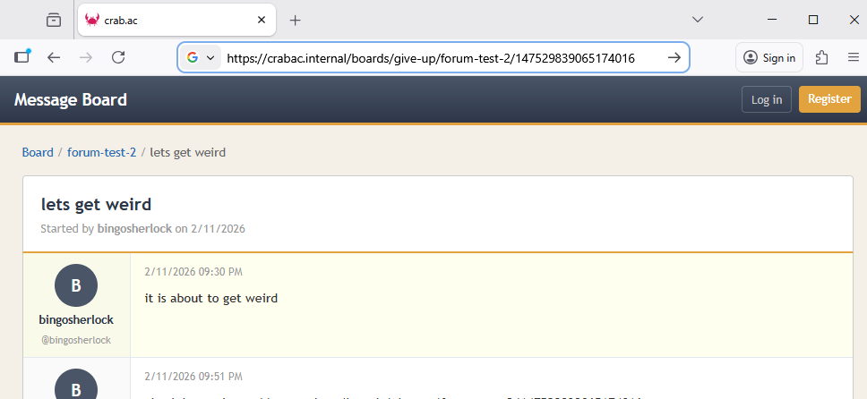

### Public Galleries

Media gallery channels can be made public, providing a browsable photo/video gallery on the web.

URL: `app.crab.ac/gallery/your-space-slug`

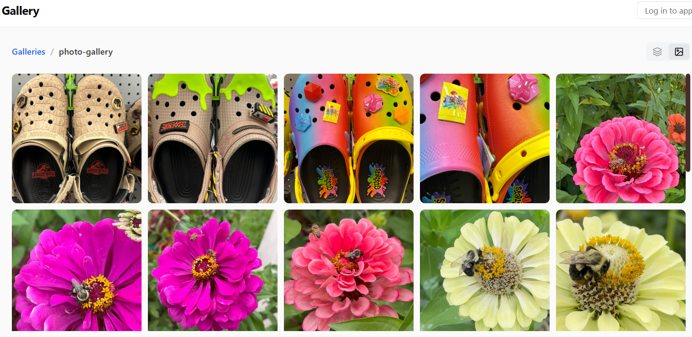

### Public Route Library

Route library channels can be made public, creating a browsable route catalog. The default view aggregates routes across all public route libraries in the space with filtering by activity type, category, and search.

URL: `app.crab.ac/routes/your-space-slug`

### Public Calendar

The community calendar can be exposed as a read-only public web page. Individual events are marked as public or private — only public events appear on the web view.

URL: `app.crab.ac/calendar/your-space-slug`

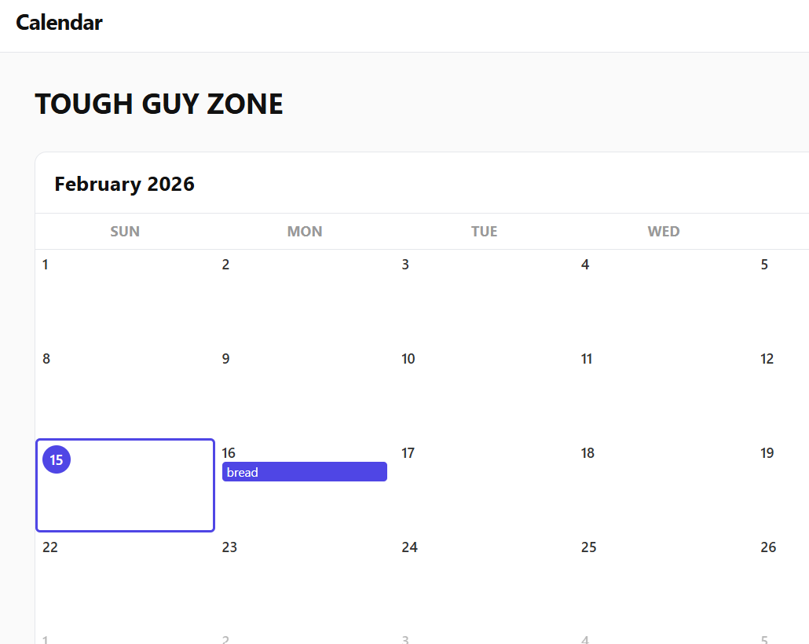

### Public Blog

Blog posts can individually be made public for an external blog page with full Markdown rendering.

URL: `app.crab.ac/blog/your-space-slug`

<!-- TODO: screenshot of public blog page -->
<!--  -->

### Configuration

Each public component is controlled by its own toggle in admin settings:

- **Enable Public Boards** — exposes forum channels marked as public
- **Enable Public Galleries** — exposes media gallery channels marked as public
- **Enable Public Routes** — exposes route library channels marked as public
- **Enable Public Calendar** — exposes events marked as public
- **Enable Public Blog** — exposes blog posts marked as public
- **Allow Anonymous Browsing** — controls whether visitors need to log in to view public content

---

## Cross-Community: Portals

Portals allow two or more completely independent spaces to share a single channel between them. Messages sent in one space appear in the others, and vice versa. This works for any channel type — text channels, media galleries, and route libraries can all be portaled.

A single channel can be portaled into multiple spaces simultaneously. For example:

- A **city cycling coalition** portals a single route library into five different club spaces — every group curates and benefits from the same collection of local routes
- A **running club** and a **cycling club** portal a shared media gallery for race day photos — members of either group upload to the same gallery without joining both spaces
- A **neighborhood association** and the **local parks department** portal a `#park-projects` channel for public collaboration while keeping internal discussions private

Portals can be created directly (if you have permission in both spaces) or proposed via a portal invite that the target space's admins can accept or reject.

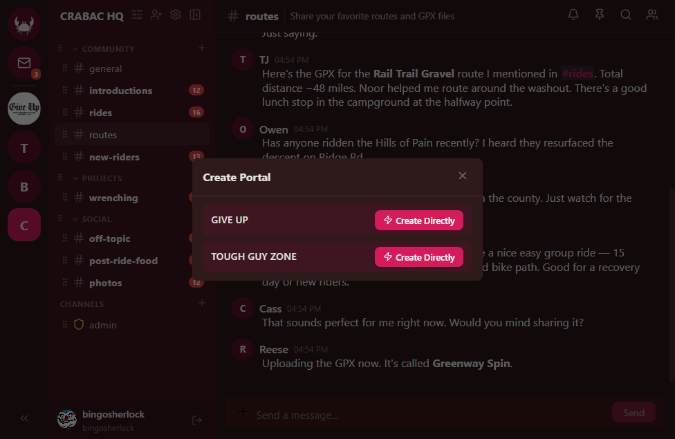

---

## Built for Outdoor Communities

While crab.ac works for any kind of community, its feature set has deep support for outdoor activity groups. Here's how the pieces fit together for an outdoor activity community:

### Route Sharing as a First-Class Feature

GPX files aren't just attachments — they're parsed, mapped, and indexed. Upload a ride to chat and it renders as an interactive map card. Save it to the route library and it's searchable by distance, elevation, activity type, and flatness score. Link it to a calendar event and it shows up on the event card with a map preview.

### From Chat to Calendar to Route to Ride

The typical flow for organizing a group ride:

1. Someone shares a GPX file in `#ride-ideas` — a workflow auto-imports it to the route library
2. An admin creates a calendar event linked to that route — the event inherits the route's metadata
3. Members RSVP (going/maybe/not going) — counts show on the event card
4. Ride day: photos go to `#ride-day` — a workflow auto-copies them to the media gallery
5. The public calendar shows the event, the public gallery shows the photos, the public route library has the route

### Public Presence for Community Outreach

A bike club can maintain a professional public web presence entirely within crab.ac:
- **Public calendar** for upcoming group rides and events
- **Public route library** for recommended local routes
- **Public gallery** for ride photos and event coverage
- **Public blog** for ride reports, gear reviews, and community news
- **Public forums** for open discussion

All of this is managed from the same interface where members chat, without maintaining a separate website.

<!-- TODO: screenshot of public routes page -->
<!--  -->

---

## Public Spaces & Directory

Spaces can be made public, allowing anyone to discover and join them from the "Discover Spaces" directory on the home screen. Public spaces support:

- **Tag-based filtering** — spaces can add up to 10 tags for discoverability
- **Featured spaces** — highlighted at the top of the directory by platform admins
- **Custom branding** — base color, accent color, and text color that render as gradient cards
- **Guest access** — optional email verification requirement for public joiners

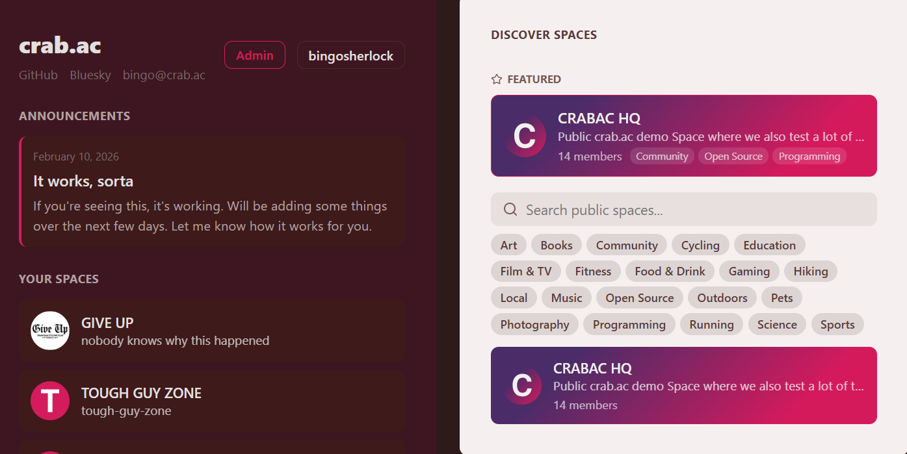

---

## User Branding & Gradient Avatars

Every user gets a personal color palette (base + accent) that renders as a gradient background on their default avatar. Colors are randomly assigned at registration and can be customized in User Settings.

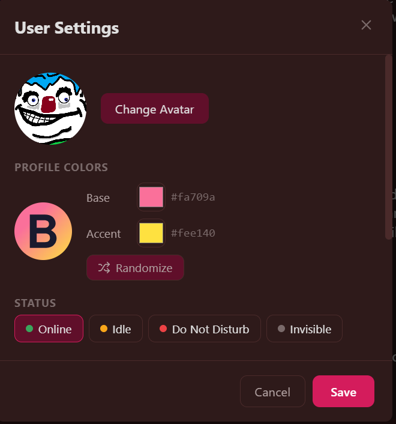

---

## Client Status

| Platform | Status |
|----------|--------|
| **Web (desktop)** | Stable — full-featured client |
| **Web (mobile)** | Responsive layout with bottom tab bar, fixed message input, mobile-optimized pages |
| **Desktop (Electron)** | Cross-platform builds (Windows, macOS, Linux) with auto-updater, tray icon, minimize-to-tray |
| **Native mobile** | In testing — OTA bundle updates managed from the admin panel |

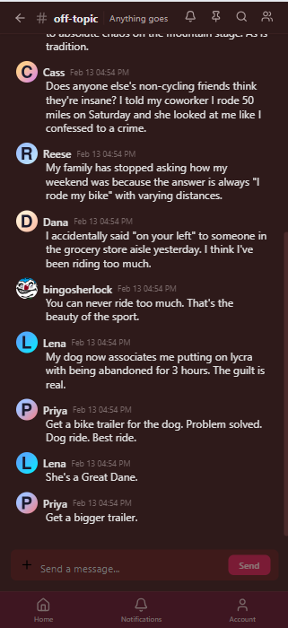

---

## Tech Stack

- **Frontend**: React 19, Vite, Zustand, Socket.io Client, MapLibre GL
- **Backend**: Express, TypeScript, Knex, MySQL, Redis, Socket.io
- **Shared**: Zod validation schemas, TypeScript types, permission bitfields
- **Desktop**: Electron with electron-builder, auto-updater
- **Mobile**: OTA bundle delivery with SHA-256 integrity verification
- **Infrastructure**: Caddy with Coraza WAF (OWASP CRS), Cloudflare Tunnels

---

## Installation

### Prerequisites

- Node.js 20+
- pnpm 9+
- MySQL 8+
- Redis 7+

### Quick Start

```bash
git clone https://github.com/cmactaggart/crabac.git
cd crabac

# Install dependencies
pnpm install

# Set up the database
mysql -u root -e "CREATE DATABASE crabac; CREATE USER 'crabac'@'localhost' IDENTIFIED BY 'crabacpass'; GRANT ALL ON crabac.* TO 'crabac'@'localhost';"

# Copy and edit environment config
cp .env.example packages/api/.env
# Edit packages/api/.env with your SMTP credentials, JWT secret, etc.

# Run database migrations
pnpm db:migrate

# (Optional) Seed with sample data
pnpm db:seed

# Build the shared package
pnpm --filter @crabac/shared run build

# Start development servers
pnpm dev
```

The web client will be available at `http://localhost:5173` and the API at `http://localhost:3001`.

### SMTP Configuration

crab.ac sends email for account verification, magic link login, and password resets. Configure these values in `packages/api/.env`:

```env
SMTP_HOST=email-smtp.us-east-1.amazonaws.com
SMTP_PORT=587
SMTP_USER=your-smtp-username
SMTP_PASS=your-smtp-password
SMTP_FROM=Your App <noreply@yourdomain.com>
```

**Heads up:** Most residential ISPs and many cloud providers block outbound SMTP traffic by default. Rather than fighting your ISP, use a commercial SMTP provider:

- **Amazon SES** — cheap, reliable, requires domain verification
- **Resend** — developer-friendly, generous free tier
- **Postmark** — great deliverability, straightforward setup
- **Mailgun**, **SendGrid** — established options with free tiers

**SMTP is not optional.** New users must verify their email before they can log in. Make sure your SMTP credentials are configured and working before inviting anyone.

### Admin Access

Admin access is controlled by a comma-separated list of email addresses in your `.env`:

```env
ADMIN_EMAILS=you@yourdomain.com,another-admin@yourdomain.com
```

Any registered user whose email matches this list gets an **Admin** button on the home screen. The admin panel provides user management, space management, system announcements, global bans, and global report moderation.

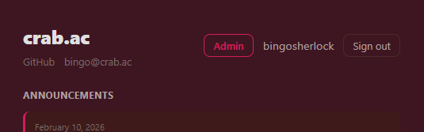
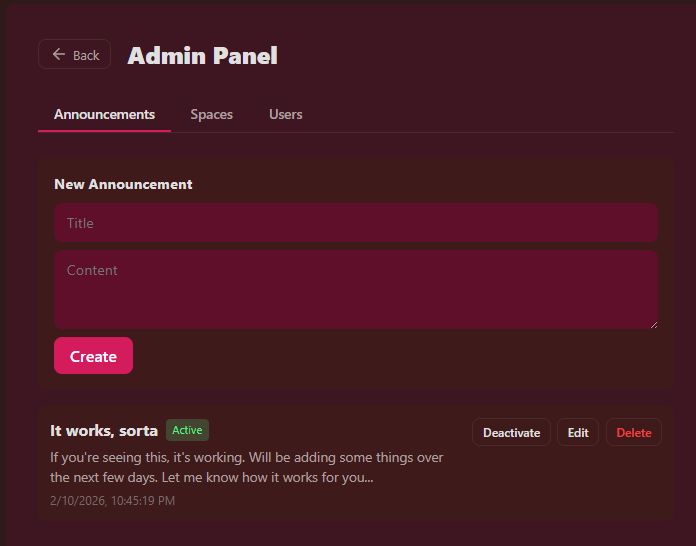

### Production Deployment with Caddy + Cloudflare Tunnels

For production deployments, we recommend a setup that avoids exposing any public ports on the host machine:

1. **Caddy with Coraza WAF** runs on a local-only port (e.g., `:3030`) and reverse-proxies to the API and frontend. The included `infra/Caddyfile` configures OWASP Core Rule Set for request filtering and routes Socket.io traffic around the WAF.

2. **Cloudflare Tunnel** (`cloudflared`) connects your domain to the local Caddy port without opening any inbound ports.

```
Internet -> Cloudflare Edge -> cloudflared tunnel -> Caddy (:3030, WAF) -> Express API (:3001)
                                                                        -> Vite Dev (:5173)
```

This gives you:
- **No exposed ports** — the server has no public-facing listeners
- **DDoS protection** from Cloudflare's edge network
- **WAF** via Coraza with OWASP CRS anomaly scoring
- **TLS termination** at Cloudflare

```bash
# Install cloudflared
# See: https://developers.cloudflare.com/cloudflare-one/connections/connect-networks/

# Create a tunnel pointing to your Caddy port
cloudflared tunnel create crabac
cloudflared tunnel route dns crabac app.yourdomain.com

# Build Caddy with Coraza WAF plugin
xcaddy build --with github.com/corazawaf/coraza-caddy/v2

# Run Caddy
./caddy run --config infra/Caddyfile

# Run cloudflared as a service
sudo cloudflared service install
```

---

## Security

- **Email verification** and **magic link login**
- **TOTP two-factor authentication** with QR code setup and backup codes
- **JWT access + refresh token** auth with automatic client-side refresh
- **Rate limiting** on auth, public, and webhook endpoints
- **Web Application Firewall** (Coraza/OWASP CRS) in the default deployment config
- **Content Security** — uploaded non-image files forced to download, `X-Content-Type-Options: nosniff` headers
- **Ban enforcement** — global and space-level bans enforced at the middleware layer
- **Block filtering** — blocked users' messages hidden from all listings
- **SSRF protection** — outgoing webhook actions block private IP ranges

---

## API Documentation

See [docs/api.md](docs/api.md) for the complete REST API reference (v0.4.0), including all endpoints, request/response formats, WebSocket events, and permission requirements.

---

## License

[MIT](LICENSE) - Copyright (c) 2025-2026 The crab.ac Contributors
